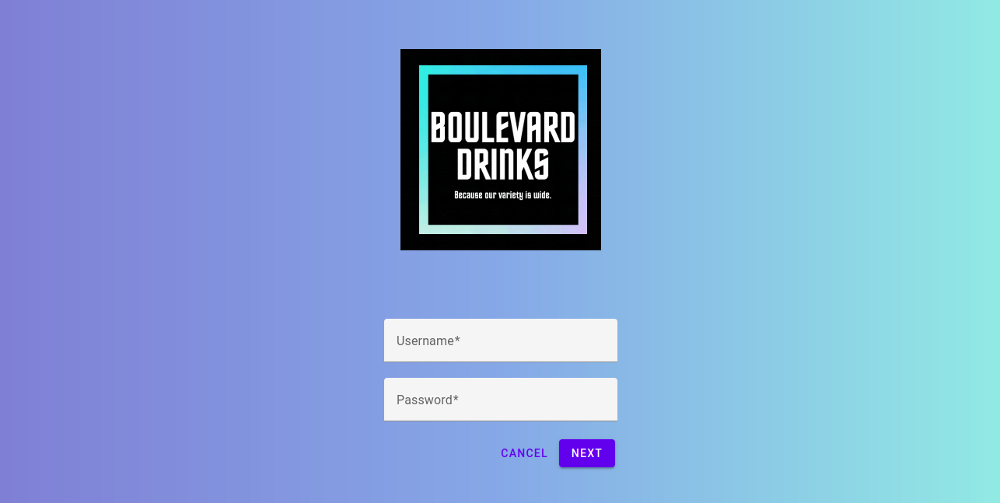
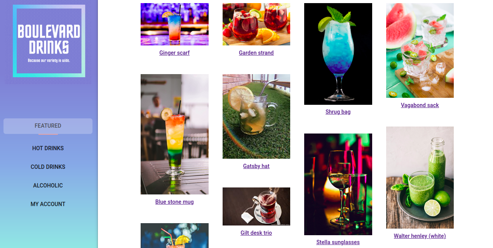

# Project Overview - Boulevard Drinks Store
```
{
  "group": {
    "number": 25,
    "members": [
        {
            "name": "Ana Vitória Gouvêa de Oliveira Freitas",
            "uspId": 11370196
        },
        {
            "name": "Sofhia Gonçalves",
            "uspId": 11735035 
        },
        {
            "name": "Matheus Luís Oliveira Silva",
            "uspId": 11847429
        }
    ]
  }
}
```

## 1. Functional Requirements
-  The system will have two type of users: clients and vendors;
-  Inside the database the records will include: client's and vendor's personal data and products metadata;
-  The store sells only products and those products will be drinks;
-  Selling products will follow a cart logic;
-  The store management will be available only for vendors;
-  The system will be responsive and will have good usability;

## 1.1 Non-functional Requirements
- Our store is commited with customer safety, so every transaction and data is held and transported securely. In addition to that, our clients are capable to select videos of recipes to accompany the drink they just bought.

## 2. Project Description
Our store sells drinks in all types: hot, cold and alcoholic. It will have all of the functionalities bellow:

- Login and sign in
- The vendors are capable to add or remove the drinks they sell
- Cart checkout for the clients
- Suggested videos to accompany the drink

In order to attend those requirements, the store has the following pages:

### Login Page



OBS: both client and vendors login in the same page and the validation is made inside the backend.

### Home Page



If the client and vendor are logged in, both are able to see the same home page. The thing that will differ for them is when they click in the drink name. This event should redirect them to the edditing page or the page with more details of the product, depending on the user type that is logged in.