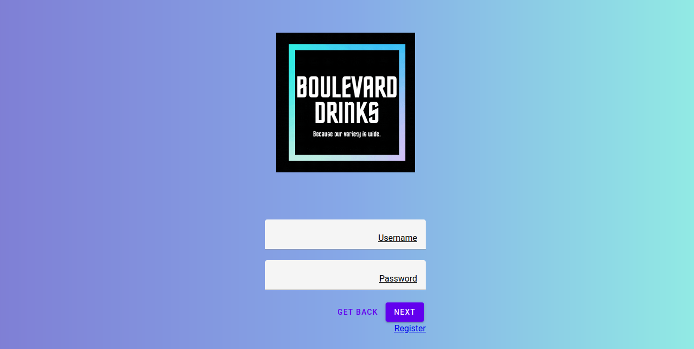
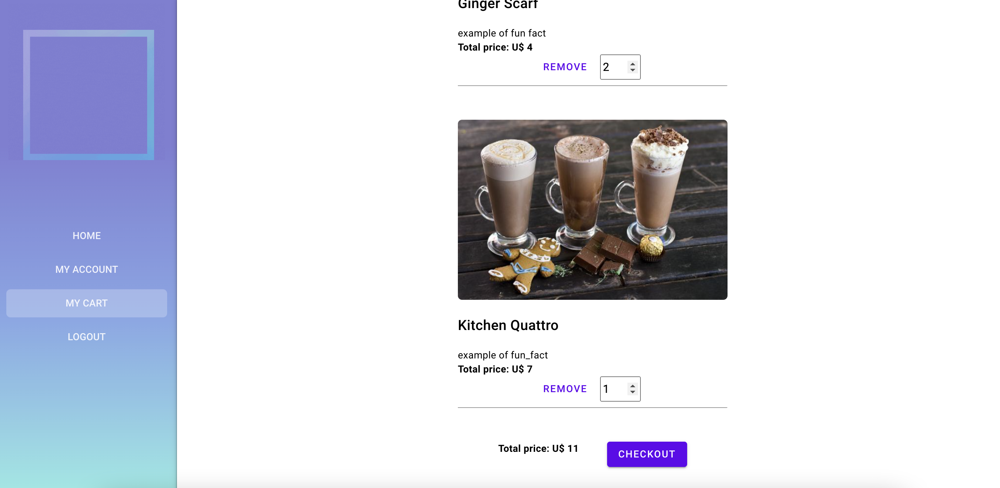

# Project Overview - Boulevard Drinks Store
```
{
  "group": {
    "number": 25,
    "members": [
        {
            "name": "Ana Vitória Gouvêa de Oliveira Freitas",
            "uspId": 11370196
        },
        {
            "name": "Sofhia Gonçalves",
            "uspId": 11735035 
        },
        {
            "name": "Matheus Luís Oliveira Silva",
            "uspId": 11847429
        }
    ]
  }
}
```

## 1. Functional Requirements
-  The system will have two type of users: clients and vendors;
-  Inside the database the records will include: client's and vendor's personal data and products metadata;
-  The store sells only products and those products will be drinks;
-  Selling products will follow a cart logic;
-  The store management will be available only for vendors;
-  The system will be responsive and will have good usability;

## 1.1 Non-functional Requirements
- Our store is commited with customer safety, so every transaction and data is held and transported securely. In addition to that, our clients are capable to select videos of recipes to accompany the drink they just bought.

## 2. Project Description
Our store sells drinks in all types: hot, cold and alcoholic. It will have all of the functionalities bellow:

- Login and sign in
- The vendors are capable to add or remove the drinks they sell
- Cart checkout for the clients
- Suggested videos to accompany the drink

In order to attend those requirements, the store has the following pages:

### Register Page


This is the register page, where the clients create their accounts to be able to navigate and buy products.


### Login Page



OBS: both client and vendors login in the same page and the validation is made inside the backend.

### Home Page


If the client and vendor are logged in, both are able to see the same home page. The thing that will differ for them is when they click in the drink name. This event should redirect them to the edditing page or the page with more details of the product, depending on the user type that is logged in.

### Product Page


This is the client product page, it is possible to see a brief description of the product and a button for the functionality to add this item to client's cart.


This is the admin product page, where the admin can add, edit or remove a product.

### Cart Page



This is the cart page, it is possible to see the functionality of removing item from cart and checkout (the function that leads to the payment page).

### Checkout Page


This is the checkout page, where the client can finalize their purchase.

### Account Page


This is the account page, where the user can see/edit their details.

## Navigation diagram


## How to run it

To run the pages, you need to have the 12.13.0 node version. If you already have node installed, you can do the downgrade by doing

```
$ sudo npm install -g n
$ sudo n 12.13.0
```

1. Clone the repo using the following command: `git clone https://github.com/ana-vitoria-freitas/OnlineStoreAssignment.git`

### Application

2. Go inside the MockUp repository

3. Run `npm install` to install all the dependencies
   
4. Run `npm start` and then go to http://localhost:8080/homePage

### Data Base Server

2. Go inside the BackEnd repository

3. Run `npm install` to install all the dependencies
   
4. Run `npm start` 

## How to test it

You can register as a normal customer, just click in "My Account" and you will be redirected to the login page,
where there is a button you can register.

To log as an admin, you can user these credentials:

```
username: admin
password: 12345678
```

As an normal customer, you will be able to add and remove products to cart, change some of your account details, do the checkout, search for the name of an specific drink and logout.

As an admin, you can also add new products, edit and remove existing ones, and manage the users, deleting or changing their functions.

## Test Plan

1. Go to the login page and try to login with incorrect information: empty username, empty password, invalid username or incorrect password.
2. Click on Register and try to create an account with incorrect information: empty name, empty email, empty password, invalid email or username already used.
3. Create an account and go to the cart, verify if the cart is empty.
4. Go to the home page and search for "Surf and Perf Shirt", verify if the page filters the products.
5. Click in one of the products and see if it opens the product description. Click in "Add to cart" and check if it correctly adds the product to the cart
6. Click in "Remove" in the product in the cart and verify if it is removed
7. Add some products to the cart, then go to the cart and click in checkout. Write some random card information and click in "Purchase order". Check if the cart got empty.
8. Go to "My account" page in menu and try to edit the name, cpf and email. It should not let you edit this fields.
9. Try to edit some other fields as mobile phone or address. Click in "Save", go to home and then comeback to "My account". Check if the data was saved.
10. Click in "Logout" in menu and login as admin. Check if the menu is different from the normal customer menu.
11. Go to "Add new product" in menu and try to add a new product. Check if it appears in home page.
12. Click in some random product in home page and try to edit it, then click in "Save". Go to home page and then comeback to this product to check if the data was saved.
13. Click in some random product in home page and try to remove it. Go to home page and check if it is not in the list anymore.
14. Go to "Manage users" in menu to see the user list. Try to change the user you created ealier from user to admin, clicking on  "Edit Role". Check if the user is now an admin by login in it again and checking the permissions.
15. Go to "Manage users" in menu and try to delete an user. Check if it was really deleted by trying to login in it again.

## Test Results

1. A popup will appear with an error message.
2. An error message will appear between informing the problem.
3. A message will appear informing that the cart is empty.
4. The page will show only the product searched.
5. The product will appear in the cart.
6. The product will be removed from the list.
7. A message will appear informing that the cart is empty.
8. The fields will not let you edit them.
9. The data will be updated.
10. The menu will show other options like "Manage users" and "Add new product"
11. It will appear in home page.
12. The data will be updated.
13. The product will be removed from the list.
14. The user will have all the admin permissions.
15. A popup will appear with an error message informing that the user doesn't exists.